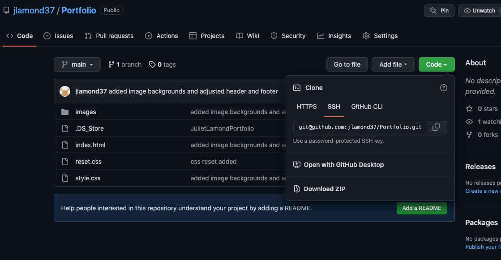

# <Juliet Lamond Portfolio>

## Description

I built my portfolio to showcase my work to potential employers. It makes accessing my work more accessible. I learned how to structure a web page and it gave me an opportunity to start playing around with CSS.

## Installation

- Go to <a> https://github.com/jlamond37/Portfolio </a>
- Click on Code
- Copy the SSH key and git clone

## Usage

-Go to GitHub and clone:

